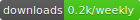

# packinfo （Cli）
[](https://www.npmjs.com/package/packinfo)

A tool to print bundle info, such as packing time, packing author and so on in browser console.

# Usage

```
    $ npm i packinfo -g
```

```
    $ cd [your project]
```

```
    $ cd [dir which the 'index.html' file is in ]
```

```
    $ packinfo
```

```
      or
```

```
    $ packinfo -a [who packs] -i [some comment] -c [version]
```

## See in index.html


## See in borwser console


